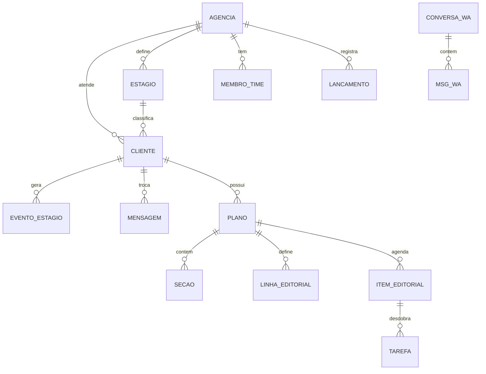

# Regma

**Plataforma de operação para agências de marketing e profissionais que gerenciam clientes e conteúdo.**

Centraliza CRM, planejamento editorial, aprovação de conteúdo pelo cliente, WhatsApp, automações
e e-mail marketing em um só lugar — com o cliente final aprovando conteúdo pelo celular, sem
precisar aprender ferramenta nova.

> **Sobre este repositório:** o Regma é um produto comercial e o **código-fonte é privado**.
> Este espaço documenta o problema, a arquitetura e as decisões técnicas do projeto.
> Acesso ao código pode ser concedido pontualmente em processos seletivos — é só pedir.

`Next.js 16` · `TypeScript` · `PostgreSQL` · `Prisma` · `Supabase` · `Vercel` · `Claude API` · `Evolution API`

**Em implantação na primeira operação real.**

---

## Quem é quem

A palavra "cliente" aparece com dois sentidos no produto, então vale separar:

| | Quem é | O que faz no Regma |
|---|---|---|
| **Agência** | O cliente do Regma — quem assina | Opera tudo: CRM, planejamento, produção, financeiro |
| **Cliente da agência** | Quem contrata a agência | Entra só no portal: vê, aprova e comenta o conteúdo pelo celular |

Essa distinção não é vocabulário — é a decisão de arquitetura mais importante do sistema. Ver
[três camadas de identidade](#três-camadas-de-identidade-de-propósito).

---

## O problema

Agência de marketing opera espalhada. O planejamento fica num lugar, o calendário em outro, a
aprovação do cliente vira uma thread de WhatsApp sem rastro, e o comercial mora numa planilha.
Ninguém sabe qual conteúdo está aprovado sem procurar.

Eu vivi isso operando conteúdo para clientes. Cheguei a usar Notion para acompanhar, mas a
maioria dos clientes não conseguia usar — principalmente na etapa que mais importa, a aprovação.
Cliente não quer aprender ferramenta: quer abrir o celular, ver o post e dizer sim ou não.

O Regma nasceu dessa dor específica: **centralizar a operação da agência sem transferir
complexidade para o cliente.**

---

## Escopo construído

| Área | O que faz |
|---|---|
| **CRM** | Pipeline por estágio, temperatura de lead, histórico de atividade, importação de contatos |
| **Editorial** | Linhas editoriais, planos de conteúdo, calendário, tarefas e feed de produção |
| **Portal do cliente** | Área própria para ver, aprovar e comentar conteúdo pelo celular |
| **WhatsApp** | Caixa de conversas, mídia, fila de disparo, conversão de conversa em lead |
| **IA** | Geração de pautas, sugestão por seção, resumo de reunião, briefing a partir de transcrição |
| **Campanhas** | E-mail com domínio remetente, supressão, webhooks de retorno |
| **Automação** | Regras, fluxos, enrolamento de contatos e processamento agendado |

Desenvolvimento solo. **285 commits · ~41 mil linhas · 59 modelos de dados.**

---

## Arquitetura

```
┌──────────────────────────────────────────────────────────┐
│  Next.js 16 (App Router) · TypeScript · Vercel           │
│                                                          │
│  /(app)    painel da agência      → sessão NextAuth      │
│  /cliente  portal do cliente      → sessão própria       │
│  /u /f /briefing  links públicos  → acesso por token     │
│  /api      ~70 rotas                                     │
└───────┬──────────────────┬──────────────────┬────────────┘
        │                  │                  │
   ┌────▼─────┐      ┌─────▼──────┐   ┌───────▼──────────┐
   │ Postgres │      │  Supabase  │   │ Servidor Evolution│
   │ (Prisma) │      │  Storage   │   │ auto-hospedado    │
   │59 modelos│      │  arquivos  │   │ 1 instância/conta │
   └──────────┘      └────────────┘   └───────┬──────────┘
                                              │ webhook
   ┌──────────────────┐  ┌───────────────┐    ▼
   │ Claude (Sonnet)  │  │  Google APIs  │  WhatsApp
   └──────────────────┘  └───────────────┘

                Vercel Cron (diário) → processamento de fila
```

As decisões por trás desse desenho estão em **[docs/decisoes-tecnicas.md](docs/decisoes-tecnicas.md)**.

---

## Modelo de dados

As entidades centrais e como se relacionam. O schema completo tem **59 modelos**; abaixo estão
os doze que sustentam o fluxo principal.



**O eixo do sistema é `Agência → Cliente → Plano → Item Editorial`.** Toda a operação pendura
nesse caminho: o CRM entra por `Estágio`, a produção por `Tarefa`, a aprovação acontece no
`Item Editorial`, e o WhatsApp conecta conversa a cliente.

Escopo por agência é aplicado no schema — cada entidade de topo carrega o vínculo com a agência
dona, e nenhuma consulta atravessa esse limite.

---

## Duas decisões que definem o sistema

### Três camadas de identidade, de propósito

A agência autentica por NextAuth. O cliente final tem sessão própria com senha — porque ele
**não deve existir como usuário da plataforma**: não vê o painel, não ocupa assento, não tem
permissão a gerenciar. E os links por token servem para quem precisa ver ou responder uma coisa
só, sem criar conta.

Unificar tudo num sistema de auth seria mais simples de construir e pior de usar. A fronteira
entre "quem opera" e "quem aprova" é de produto, não de implementação — e ficou explícita na
arquitetura em vez de virar checagem de papel espalhada por cada tela.

### O WhatsApp é um servidor auto-hospedado, por conta de margem

A primeira versão foi um motor próprio com Baileys, rodando local. Funcionava — e caía toda vez
que a máquina desligava. Sessão persistente de WhatsApp precisa de um host que não durma, e isso
não é resolvível com esforço: é requisito de infraestrutura.

A troca não foi para um provedor pago, e o motivo é de negócio, não técnico:

> Provedor tipo Z-API cobra **por número** (~R$100/mês cada). Numa plataforma cujo papel é
> fornecer a conexão de WhatsApp para todos os seus clientes, preço por unidade estoura a
> margem assim que a base cresce. Um servidor próprio segura dezenas de números por custo fixo.

Hoje é um servidor **Evolution auto-hospedado**, com uma instância por conta e o webhook
apontando de volta para a aplicação.

**Trade-off:** infraestrutura própria para monitorar, em troca de um custo que não cresce com a
base. Foi a decisão de custo unitário que determinou a arquitetura — não o contrário.

---

## Como as proteções apareceram

Nenhuma das proteções abaixo nasceu de checklist. Elas vieram de um hábito: a cada frente
entregue, submeter o próprio código a uma **revisão adversarial feita com IA** — a pergunta não
era "está funcionando?", e sim *"como alguém quebraria isso?"*.

A IA levantava os candidatos. **A triagem era minha:** o que era achado real e o que era falso
positivo, o que era grave e o que podia esperar, e em que ordem corrigir. O histórico do
repositório mostra o padrão — rodadas de varredura seguidas de commits que fecham os achados por
severidade, dos graves primeiro.

Foi numa dessas rodadas que apareceu a falha de **segurança entre contas** que originou a regra
de ouro da nomenclatura de instância, descrita abaixo. Ela não teria aparecido em teste de uso:
o produto funcionava perfeitamente para quem não estivesse tentando invadir o vizinho.

Vale dizer o que isso significa na prática: **as proteções não estão aqui porque eu sabia que
precisava delas.** Estão porque eu procurei o que estava errado depois de achar que tinha
terminado — e achei.

---

## Segurança

Decisões tomadas durante a construção:

- **Segredos nunca versionados** — `.env*` ignorado desde o início; em 285 commits, nenhum
  arquivo de ambiente ou chave entrou no repositório
- **Chave de serviço só no servidor**, nunca exposta ao cliente
- **Dados pessoais fora do código** — a lista de acesso vive em variável de ambiente, e falha
  fechada se não estiver definida
- **Senha com bcrypt**, nunca em texto puro
- **Limite de tentativas de login** por identificador e IP
- **Proteção contra enumeração de contas** no portal do cliente

O último merece o código, porque é o tipo de coisa que só aparece quando se pensa em superfície
de ataque:

```ts
/** Hash descartável: quando o e-mail não existe, ainda assim gastamos o tempo de um
 *  bcrypt. Sem isso, "responde rápido" vira um jeito de descobrir quais e-mails
 *  têm conta. */
const HASH_FALSO = "$2a$12$..."
```

```ts
// Resposta idêntica para e-mail inexistente, conta desativada e senha errada:
// distinguir os casos entregaria quem é cliente de quem.
const errada = NextResponse.json({ error: "E-mail ou senha incorretos." }, { status: 401 })
```

Login que responde rápido para e-mail inexistente e devagar para e-mail existente entrega a lista
de quem tem conta. Num produto B2B, isso significa entregar a carteira de clientes da agência.

E, no multi-inquilino, a superfície mais perigosa é o vizinho:

```ts
/**
 * REGRA DE OURO: o nome da instância é SEMPRE derivado do dataId da sessão,
 * nunca lido do banco. O nome é previsível (`regma_<dataId>`), então confiar num
 * campo gravável deixaria um inquilino apontar para a conexão de outro — e
 * enviar mensagem pelo número alheio ou pedir o QR dele.
 */
```

Identificador de recurso derivado da sessão, nunca de campo que o próprio usuário escreve. Sem
isso, uma agência poderia sequestrar a conexão de WhatsApp de outra.

### Pendente antes do uso com dados de terceiros
- [ ] Revisão completa de isolamento entre tenants
- [ ] Auditoria das políticas de acesso ao storage
- [ ] Revisão de expiração e escopo dos links por token

O escopo por usuário está aplicado no schema, mas ainda não foi auditado ponta a ponta — e
enquanto isso não acontecer, não entra em uso com dado real de cliente.

---

## Status

Em desenvolvimento ativo. O núcleo está construído e navegável; faltam ajustes, a revisão de
segurança acima e o lançamento.

---

**Gabriella Grecco** · [LinkedIn](https://linkedin.com/in/gabriellagrecco)
Código-fonte privado — acesso mediante solicitação.
